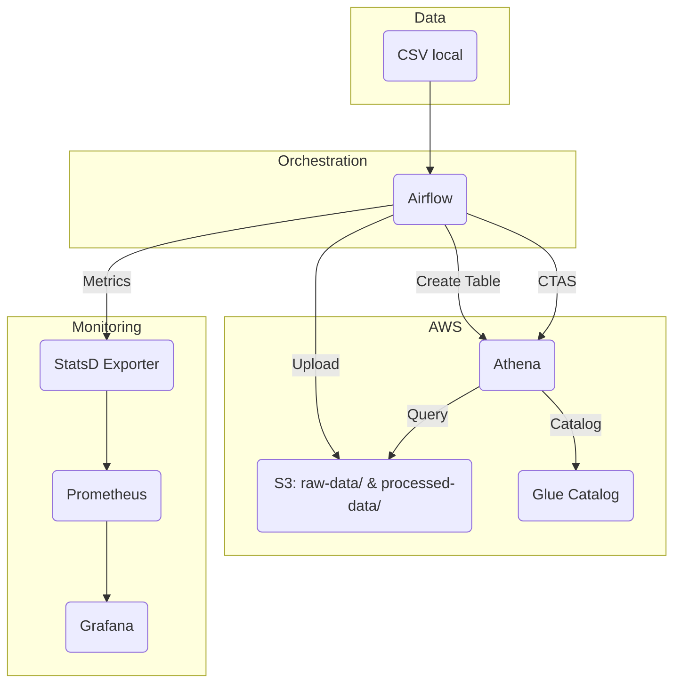

# 🚀 Pipeline de Dados: Airflow + Athena/S3 + Prometheus/Grafana

Demonstração de pipeline moderno usando **Apache Airflow** para orquestrar ingestão, transformação e observabilidade de dados na AWS. Ideal para entrevistas, POCs e estudos de arquitetura de dados com governança e monitoramento.

---

## 📚 Sumário

- [Visão Geral](#visão-geral)
- [Arquitetura](#arquitetura)
- [Funcionalidades](#funcionalidades)
- [Estrutura do Repositório](#estrutura-do-repositório)
- [Pré-requisitos](#pré-requisitos)
- [Configuração do Ambiente](#configuração-do-ambiente)
- [Execução do Pipeline](#execução-do-pipeline)
- [Observabilidade](#observabilidade)
- [Governança e Segurança](#governança-e-segurança)
- [Troubleshooting](#troubleshooting)
- [Política IAM Recomendada](#política-iam-recomendada)
- [Roadmap](#roadmap)
- [Talk Track para Entrevista](#talk-track-para-entrevista)

---

## 🎯 Visão Geral

Este projeto demonstra:

- **Ingestão** de um CSV local para o S3 (raw)
- **Criação de tabela externa** (Athena/Glue)
- **Transformação CTAS** para Parquet particionado
- **Data Quality** (opcional)
- **Observabilidade** com Prometheus e Grafana
- **Governança**: IAM mínimo, Glue Catalog, boas práticas de segurança

---

## 🏗️ Arquitetura



---

## ⚙️ Funcionalidades

- **DAG `orders_pipeline`** com as tasks:
    1. `upload_csv_to_s3`: envia `data/orders.csv` para `s3://<bucket>/raw-data/orders.csv`
    2. `ensure_glue_db`: cria o database no Glue se não existir
    3. `create_external_raw_orders`: cria tabela externa sobre o CSV (Glue/Athena)
    4. `drop_orders_summary_if_exists`: garante idempotência do CTAS
    5. `clear_output_prefix`: limpa `processed-data/orders_summary/` antes de reprocessar
    6. `ctas_orders_summary`: CTAS no Athena para gerar Parquet em `processed-data/orders_summary/`
    7. *(Opcional)* Checagens de Data Quality (existência, nulos, contagem)
- **Observabilidade**: métricas Airflow via StatsD → Prometheus → Grafana
- **Governança**: exemplos de IAM mínimo, uso do Glue Catalog, logs por task, recomendações de segurança

---

## 📁 Estrutura do Repositório

```
├── dags/
│   └── orders_pipeline.py      # DAG principal
├── data/
│   └── orders.csv              # Base demo
├── docker/
│   └── airflow/                # Dockerfile + requirements do Airflow
├── prometheus/
│   └── prometheus.yml          # Configuração Prometheus
├── grafana/                    # Dashboards/provisioning (opcional)
├── .env                        # Variáveis locais (NÃO versionar)
├── docker-compose.yml
```

---

## 📝 Pré-requisitos

1. **Bucket S3** na sua região (ex: `pt-data-lab` em `us-east-2`)
    - Prefixos: `raw-data/`, `processed-data/`, `athena-staging/`
2. **Usuário IAM** com Access Key/Secret e política mínima (veja [Política IAM Recomendada](#política-iam-recomendada))
3. **Docker** + **Docker Compose** instalados

---

## ⚡ Configuração do Ambiente

1. **Crie o arquivo `.env`** (NÃO comite!):

    ```
    AWS_ACCESS_KEY_ID=...
    AWS_SECRET_ACCESS_KEY=...
    AWS_DEFAULT_REGION=us-east-2
    S3_BUCKET=pt-data-lab
    ```

2. **Build inicial (opcional):**
    ```bash
    docker compose build --no-cache
    ```

3. **Inicialize o Airflow:**
    ```bash
    docker compose up airflow-init
    ```

4. **Suba os serviços:**
    ```bash
    docker compose up -d
    ```

---

## 🚦 Execução do Pipeline

1. Acesse o Airflow: [http://localhost:8080](http://localhost:8080)  
   *(user/pass padrão: airflow/airflow)*
2. Ative e execute a DAG `orders_pipeline`
3. Monitore as tasks e logs pela UI

---

## 📊 Observabilidade

- **Prometheus**: [http://localhost:9090](http://localhost:9090)
- **Grafana**: [http://localhost:3000](http://localhost:3000)
    - Configure a fonte Prometheus (`http://prometheus:9090`)
    - Importe dashboards de Airflow/StatsD ou use o provisioning em `grafana/`
- **Métricas úteis**: latência de tasks, falhas/sucessos por DAG, duração média, fila do scheduler

---

## 🔒 Governança e Segurança

- **Catálogo**: Glue Catalog como fonte de verdade para schemas/tabelas
- **Segurança**:
    - IAM mínimo (veja abaixo)
    - Secret scan (gitleaks) no CI
    - `.env` no `.gitignore`
    - Variáveis sensíveis fora do Git
- **Qualidade**:
    - Tasks de Data Quality prontas para habilitar
    - dbt-checks (se houver projeto dbt)

---

## 🛠️ Troubleshooting

- **Logs detalhados**: disponíveis por task na UI do Airflow
- **Permissões S3/Athena**: verifique política IAM
- **Erros de conexão**: cheque variáveis no `.env` e status dos containers
- **Observabilidade**: valide targets em `prometheus/prometheus.yml` e dashboards no Grafana

---

## 📝 Política IAM Recomendada

Exemplo mínimo para execução do pipeline:

```json
{
  "Version": "2012-10-17",
  "Statement": [
    {
      "Effect": "Allow",
      "Action": [
        "s3:PutObject",
        "s3:GetObject",
        "s3:ListBucket",
        "s3:DeleteObject"
      ],
      "Resource": [
        "arn:aws:s3:::pt-data-lab/*",
        "arn:aws:s3:::pt-data-lab"
      ]
    },
    {
      "Effect": "Allow",
      "Action": [
        "athena:*",
        "glue:*"
      ],
      "Resource": "*"
    }
  ]
}
```

---

## 🚧 Roadmap

- Ativar tasks de Data Quality como parte do pipeline
- Particionamento e compressão no CTAS (ex: snappy)
- Integração com dbt para modelagem incremental
- Linage (OpenLineage/Marquez) integrado ao Airflow
- Dashboards Grafana prontos via provisioning
- Release flow por tag com versionamento semântico

---

## 🎤 Talk Track para Entrevista

- **Contexto**: Orquestração com Airflow → ingestão S3 → modelagem via Athena (CTAS) → Parquet otimizado
- **Por quê assim?**: Baixo acoplamento, custo reduzido (Athena/S3), catálogos centralizados (Glue)
- **Qualidade & Governança**: Checagens de DQ, IAM mínimo, secret scanning, branch protection
- **Observabilidade**: Métricas de DAG/task no Grafana; troubleshooting rápido via Prometheus
- **Escalabilidade**: Particionamento, compaction, formatos colunares e modelo incremental (dbt)

---

> Dúvidas ou sugestões? Abra uma issue ou